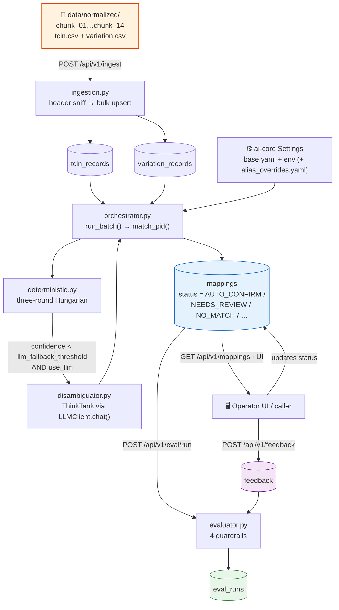
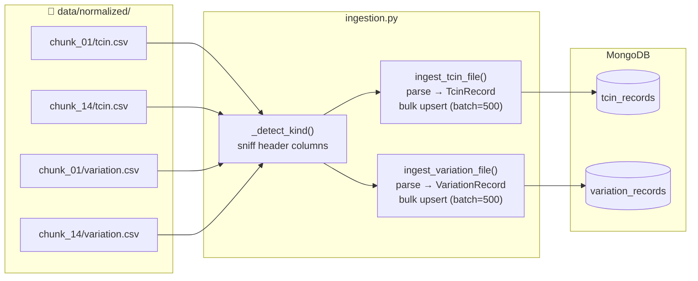
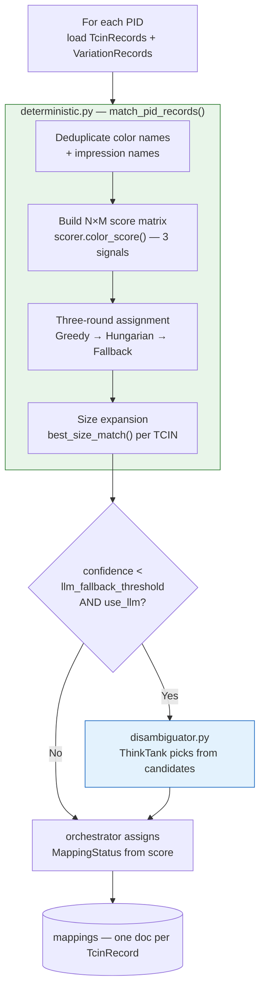
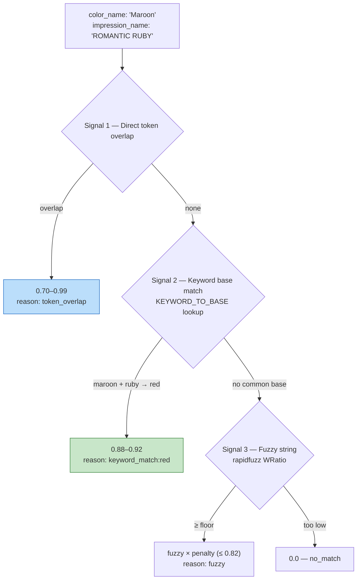
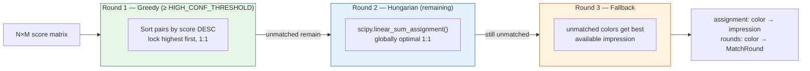
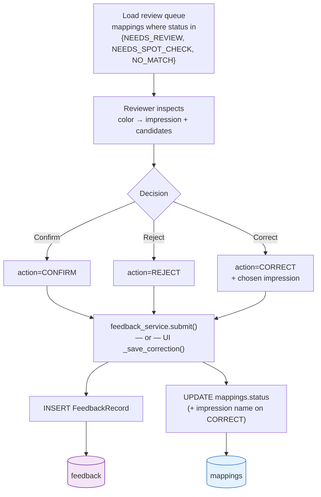
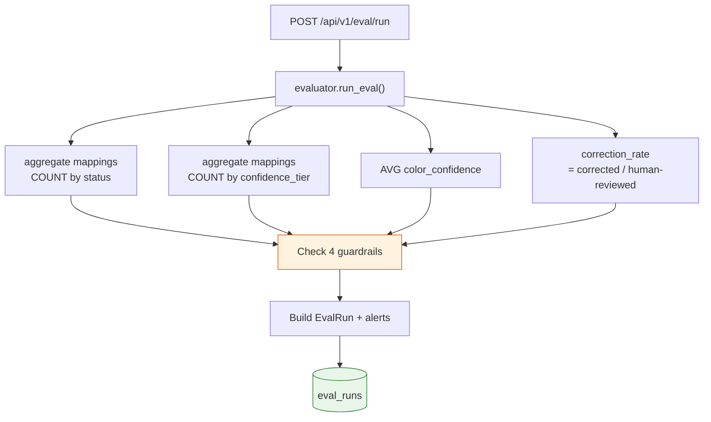

# Data Flow Design — plm-tcin-mapper

> **How to view diagrams:** All diagrams use [Mermaid](https://mermaid.js.org/). They render on GitHub and in VS Code with the *Markdown Preview Mermaid Support* extension.

This document traces data through `plm-tcin-mapper` as deployed in the `plm-ai-apps` monorepo. The service exposes the pipeline over a REST API and persists to MongoDB via the shared `ai-mongo` library. For the component diagram and design rationale, see [ARCHITECTURE.md](ARCHITECTURE.md).

> **Scope note.** The original standalone tool also shipped an automated feedback-improvement loop (alias mining, threshold tuning, shadow testing, LLM-call cost auditing). The migrated service implements the **core path** — ingestion, matching, human feedback, and evaluation. The advanced feedback-loop features are catalogued in [§7 Roadmap](#7-roadmap--not-yet-ported) so the intent is preserved for a later phase.

---

## Table of Contents
1. [Collection & Model Reference](#1-collection--model-reference)
2. [Full System Overview](#2-full-system-overview)
3. [Ingestion Pipeline](#3-ingestion-pipeline)
4. [Matching Pipeline](#4-matching-pipeline)
5. [Human Review & Feedback](#5-human-review--feedback)
6. [Evaluation Pipeline](#6-evaluation-pipeline)
7. [Roadmap — Not Yet Ported](#7-roadmap--not-yet-ported)

---

## 1. Collection & Model Reference

### MongoDB Collections (active)

| Collection | Written By | Read By | Purpose |
|---|---|---|---|
| `tcin_records` | `pipeline/ingestion.py` | orchestrator, UI | Guest-facing TCIN color + size rows |
| `variation_records` | `pipeline/ingestion.py` | orchestrator, UI | Design/manufacturing impression + size rows |
| `mappings` | `pipeline/orchestrator.py` | mappings API, evaluator, UI | One record per TCIN — match result + outcome |
| `feedback` | `services/feedback_service.py`, UI | evaluator | Human review decisions (CONFIRM / REJECT / CORRECT) |
| `eval_runs` | `pipeline/evaluator.py` | eval API, UI | Quality snapshot per evaluation run |
| `llm_calls` | *(not yet written)* | UI `llm_quality` page | LLM audit trail — see [§7](#7-roadmap--not-yet-ported) |

### Pydantic Models → Collections

All defined in [`plm_tcin_mapper/database/models.py`](../plm_tcin_mapper/database/models.py).

| Model Class | Collection | Key Fields |
|---|---|---|
| `TcinRecord` | `tcin_records` | pid, tcin_id, color, color_name, size, department_ids |
| `VariationRecord` | `variation_records` | pid, impression_id, impression_name, size, workspace_ids |
| `Mapping` | `mappings` | tcin_id, matched_impression_name, color_confidence, confidence_tier, status, match_round |
| `ColorCandidate` | embedded in `Mapping` | impression_name, score, reason |
| `FeedbackRecord` | `feedback` | mapping_id, action, suggested/original impression names |
| `EvalRun` | `eval_runs` | pct_high, avg_color_confidence, correction_rate, guardrail_alerts |

### Key Enums (all `StrEnum`)

| Enum | Values | Used In |
|---|---|---|
| `MappingStatus` | AUTO_CONFIRM, LLM_ASSISTED, NEEDS_SPOT_CHECK, NO_MATCH, NEEDS_REVIEW, CONFIRMED, REJECTED, CORRECTED | `Mapping.status` |
| `ConfidenceTier` | HIGH ≥ 0.85, GOOD ≥ 0.70, FAIR ≥ 0.50, LOW < 0.50 | `Mapping.confidence_tier` |
| `FeedbackAction` | CONFIRM, REJECT, CORRECT | `FeedbackRecord.action` |
| `MatchRound` | GREEDY, HUNGARIAN, FALLBACK, LLM | `Mapping.match_round` |

---

## 2. Full System Overview

Every box that touches MongoDB does so through `ai-mongo`'s `MongoClientManager` — the API services use the async Motor handle, while the synchronous pipeline (run in a thread pool) and the Streamlit UI use the PyMongo handle.

---

## 3. Ingestion Pipeline

**Endpoint:** `POST /api/v1/ingest` → `IngestionService` → `pipeline/ingestion.py`

Reads normalized CSV chunks and bulk-upserts them as `TcinRecord` / `VariationRecord` documents. File kind is detected by **sniffing the header row** (not by filename), so `tcin.csv` / `variation.csv` / `errors.csv` are classified automatically.

**Request options** (`IngestRequest`): `chunk` (single chunk only), `data_dir` (override), `batch_size`, `skip_existing` (insert-only vs replace), `dry_run` (parse + count, write nothing).

| `TcinRecord` field | Source column | `VariationRecord` field | Source column |
|---|---|---|---|
| `pid` | PID | `pid` | PID |
| `tcin_id` | TcinId | `impression_id` | ImpressionId |
| `color` / `color_name` | Color / colorName | `impression_name` | ImpressionName |
| `size` | Size | `size` / `size_id` | Size / SizeId |
| `department_ids` / `class_ids` | DepartmentIds / ClassIds | `workspace_ids` | WorkspaceIds |
| `partner_id` | PartnerId | — | — |

`_id`, `ingested_at`, and `source_file` are generated for traceability. Upserts are keyed on `(pid, tcin_id)` for TCINs and `(pid, impression_id, size_id)` for variations, so re-ingesting is idempotent.

---

## 4. Matching Pipeline

**Endpoint:** `POST /api/v1/mappings/run` → `MappingService` → `pipeline/orchestrator.py`

### The three scoring signals (`scorer.color_score()`)

The keyword map comes from `color_keywords.get_merged_keyword_map()`, which merges the static `BASE_COLOR_MAP` with any human-approved aliases in `config/alias_overrides.yaml` (looked up via `APP_CONFIG_DIR`).

### Three-round assignment (`deterministic._three_round_assign()`)

### Status assignment rules

| Confidence | LLM used? | Status |
|---|---|---|
| ≥ `auto_confirm_threshold` (0.85) | No | `AUTO_CONFIRM` |
| ≥ `auto_confirm_threshold` | Yes | `LLM_ASSISTED` |
| ≥ `llm_fallback_threshold` (0.60) | Yes | `NEEDS_SPOT_CHECK` |
| < `no_match_threshold` (0.75), not auto/LLM | Any | `NO_MATCH` (impression cleared) |
| otherwise | Any | `NEEDS_REVIEW` |

### Key functions

| Function | Module | Role |
|---|---|---|
| `run_batch()` / `match_pid()` | `pipeline/orchestrator.py` | Loop over PIDs; DET → LLM → persist |
| `match_pid_records()` / `_three_round_assign()` | `matching/deterministic.py` | Three-round assignment |
| `color_score()` / `build_score_matrix()` / `candidate_list()` | `matching/scorer.py` | Per-pair score + candidate alternatives |
| `best_size_match()` | `matching/size_normalizer.py` | TCIN size → best variation size |
| `get_merged_keyword_map()` | `matching/color_keywords.py` | Keywords + approved aliases |
| `disambiguate_low_confidence()` | `llm/disambiguator.py` | LLM fallback via `ai-core` `LLMClient.chat()` |

---

## 5. Human Review & Feedback

Reviewers act either through the **Streamlit operator UI** (writes Mongo directly) or via the **REST API** (`POST /api/v1/feedback`). Both paths produce a `FeedbackRecord` and update the corresponding `Mapping`.

| Action | `mappings.status` after submit |
|---|---|
| CONFIRM | `CONFIRMED` |
| REJECT | `REJECTED` |
| CORRECT | `CORRECTED` (+ new `matched_impression_name`) |

| Collection | Operation | Trigger |
|---|---|---|
| `mappings` | READ | Load the review queue |
| `variation_records` | READ | Resolve `impression_id` when correcting |
| `feedback` | INSERT | One `FeedbackRecord` per decision |
| `mappings` | UPDATE | Status (+ impression) on submit |

---

## 6. Evaluation Pipeline

**Endpoint:** `POST /api/v1/eval/run` (compute + persist) / `GET /api/v1/eval/latest` (read) → `pipeline/evaluator.py`

Aggregates the `mappings` collection into an `EvalRun` snapshot and raises guardrail alerts from `eval.*` thresholds.

### Guardrails (configurable via `eval.*`)

| Code | Trigger | Config key | Default |
|---|---|---|---|
| `LOW HIGH-CONFIDENCE RATE` | `% HIGH tier < min` | `eval.min_high_confidence_pct` | 0.40 |
| `HIGH LOW-CONFIDENCE RATE` | `% LOW tier > max` | `eval.max_low_confidence_pct` | 0.20 |
| `REVIEW QUEUE BACKLOG` | `NEEDS_REVIEW count > limit` | `eval.review_queue_backlog_limit` | 1000 |
| `LOW AVERAGE CONFIDENCE` | `avg color_confidence < min` | `eval.min_avg_confidence` | 0.60 |

The `EvalRun` snapshot records `total_mappings`, `by_status`, `by_tier`, the `pct_high/good/fair/low` distribution, `pct_confirmed/rejected`, `correction_rate`, `avg_color_confidence`, and the list of `guardrail_alerts`.

---

## 7. Roadmap — Not Yet Ported

The standalone tool included a self-improving feedback loop. These features are intentionally **out of scope for the initial service migration** but documented here so they can be re-homed into the monorepo later (most naturally as additional services + collections + a scheduled job). Each would slot cleanly onto the existing `feedback` / `mappings` data already captured.

| Capability | Original module | Would add | Notes |
|---|---|---|---|
| **LLM call auditing** | `llm/call_tracker.py`, `models_v2.LLMCall` | `llm_calls` collection | Cost / latency / hallucination tracking. The UI `llm_quality` page already reads `llm_calls` and shows an empty-state until this is wired into `disambiguator.py`. |
| **Color alias mining** | `pipeline/correction.py` | `alias_proposals` collection | Mine `CORRECTED` feedback → propose new keywords for `alias_overrides.yaml`. |
| **Threshold tuning** | `pipeline/threshold_tuner.py` | `threshold_proposals` collection | Evidence-based threshold change proposals from confirmation rates. |
| **Feedback scoring** | `pipeline/feedback_scorer.py` | — | Per-signal accuracy, ECE calibration, per-family accuracy (extends evaluator from 4 → ~22 guardrails). |
| **Shadow testing** | `pipeline/shadow_runner.py`, `models_v2.ModelSnapshot` | `model_snapshots` | A/B a proposed config on a PID sample before promotion. The `mappings/run` API already accepts a `shadow` flag + `batch_id` to support this. |
| **Correction impact tracking** | `pipeline/impact_tracker.py`, `models_v2.CorrectionImpact` | `correction_impacts` | Before/after metrics when a change is promoted. |

> The matching pipeline already writes everything these features consume (`color_match_reason`, `match_round`, `batch_id`, `confidence_tier`, full `feedback` records), so adding them later requires no changes to the core matching path.

---

*Covers: Ingestion · Matching (deterministic + ThinkTank LLM) · Human Review · Evaluation (4 guardrails). Advanced feedback-loop features tracked in §7.*
